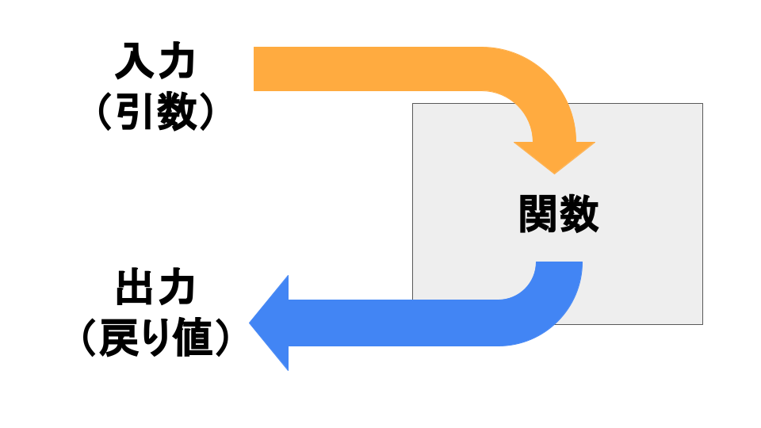
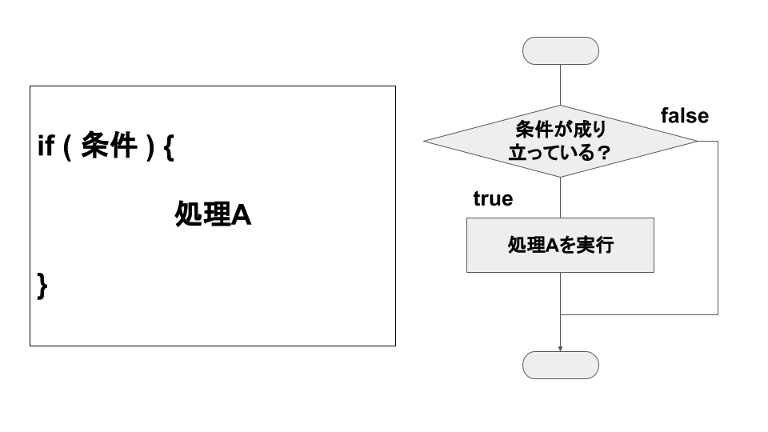
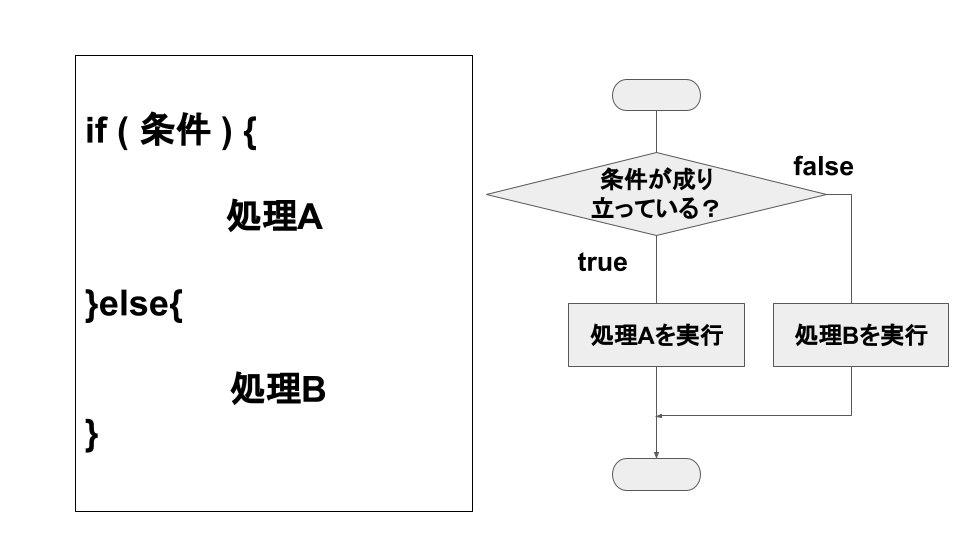
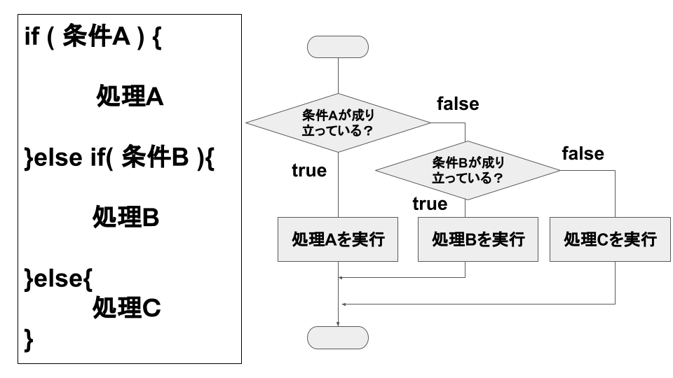
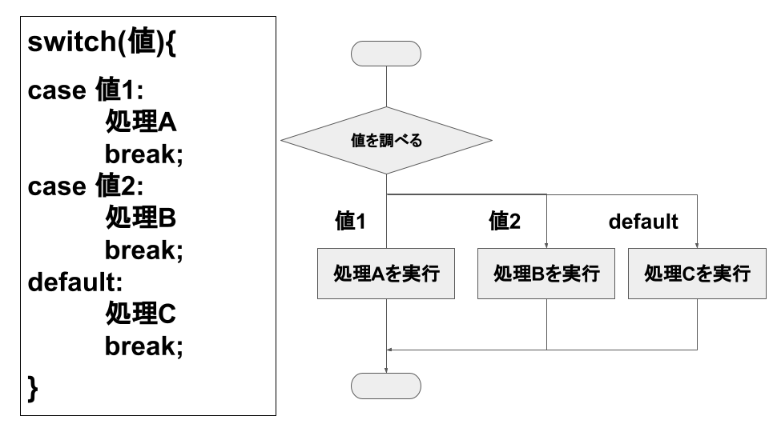
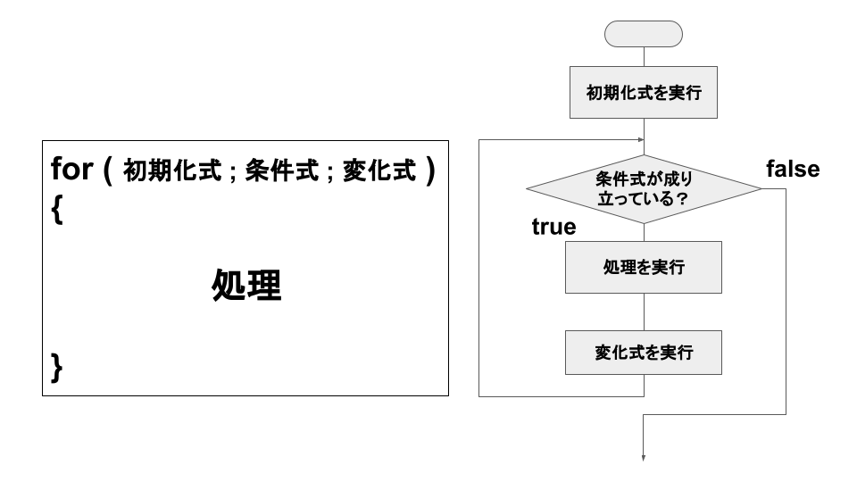
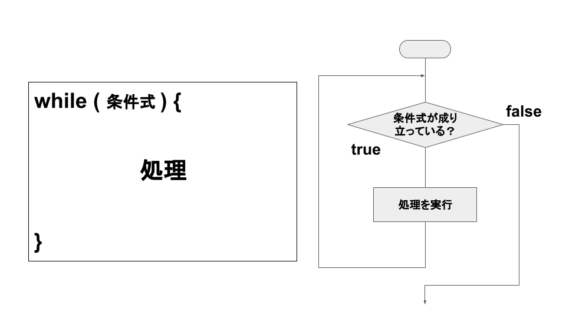

# 文法虎の巻

なるべく一言でまとめました。

詳しく知りたい、問題を解きたい人は千本ノックにチャレンジしてみましょう！

- [文法虎の巻](#文法虎の巻)
- [値：千本ノック 1セット目⚾️数値演算⚾️](#値千本ノック-1セット目️数値演算️)
  - [数値](#数値)
  - [文字列：千本ノック 2セット目⚾️文字列⚾️](#文字列千本ノック-2セット目️文字列️)
  - [真偽値](#真偽値)
- [変数：千本ノック 3セット目⚾️変数⚾️](#変数千本ノック-3セット目️変数️)
    - [書き方](#書き方)
    - [文法用語](#文法用語)
    - [おまけ](#おまけ)
- [演算子](#演算子)
  - [四則演算](#四則演算)
  - [代入](#代入)
  - [比較](#比較)
- [関数：千本ノック 8セット目⚾️関数⚾️](#関数千本ノック-8セット目️関数️)
    - [文法用語](#文法用語-1)
  - [関数を作る](#関数を作る)
    - [書き方](#書き方-1)
    - [文法用語](#文法用語-2)
  - [関数を使う](#関数を使う)
    - [書き方](#書き方-2)
    - [文法用語](#文法用語-3)
- [条件分岐：千本ノック 4セット目⚾️条件分岐⚾️](#条件分岐千本ノック-4セット目️条件分岐️)
  - [if文](#if文)
    - [else](#else)
    - [else-if文](#else-if文)
  - [switch文](#switch文)
- [繰り返し文：千本ノック 5セット目⚾️繰り返し⚾️](#繰り返し文千本ノック-5セット目️繰り返し️)
  - [for](#for)
  - [while](#while)
- [配列：千本ノック 7セット目⚾️配列⚾️](#配列千本ノック-7セット目️配列️)
    - [書き方](#書き方-3)
  - [forEach：MDN Reference](#foreachmdn-reference)
  - [for of：MDN Reference](#for-ofmdn-reference)
- [オブジェクト：千本ノック 9セット目⚾️オブジェクト⚾️](#オブジェクト千本ノック-9セット目️オブジェクト️)
    - [書き方](#書き方-4)
- [Mapオブジェクト：千本ノック 10セット目⚾️ハッシュマップ⚾️](#mapオブジェクト千本ノック-10セット目️ハッシュマップ️)
    - [書き方](#書き方-5)

# 値：[千本ノック 1セット目⚾️数値演算⚾️](https://d2tlis2max4tew.cloudfront.net/gas/ABGSZZ10_G001/ABGSZZ10_G001.html)

## 数値
* 普段使ってる十進数の書き方でOK
```javascript
console.log(10);
console.log(-100);
console.log(3.14);
```
## 文字列：[千本ノック 2セット目⚾️文字列⚾️](https://d2tlis2max4tew.cloudfront.net/gas/ABGSZZ10_G002/ABGSZZ10_G002.html)
* シングルクォーテーション、ダブルクォーテーションで囲う

```javascript
console.log('1+1は2です');
console.log('1+1は'+(1+1)+'です');
```
* バッククォーテーションで囲うと計算式などを埋め込むことができる

```javascript
console.log(`1+1は${1+1}です`);
```

## 真偽値
* ある条件を調べた結果、正しい(true)か、正しくない(false)かの二通りで表すことができる値


```javascript
console.log(`100>1を調べた結果は${100>1}です`);//100>1を調べた結果はtrueです
console.log(`-100>1を調べた結果は${-100>1}です`);//-100>1を調べた結果はfalseです
```

# 変数：[千本ノック 3セット目⚾️変数⚾️](https://d2tlis2max4tew.cloudfront.net/gas/ABGSZZ10_G003/ABGSZZ10_G003.html)
データを保存しておく場所
* データに任意の名前がつけられる
* データを一か所に保存しておくことで他の演算で使い回すことできる

### 書き方
```
let 変数名 = 値;
```
### 文法用語
* 宣言：変数を用意すること

### おまけ
* const
  * 再代入ができない変数を作れる
  * あえて変数の使い道を限定することによってバグを防ぐ
* var
  * 再宣言も再代入もできる変数を作れる
  * どこでも使えてしまうため思わぬところで値を書き換えてしまうなどバグの元になりやすい。使うのは非推奨。

# 演算子

## 四則演算
* ```+```：加算
* ```-```：減算
* ```*```：乗算
* ```/```：除算
* ```%```：余り


```javascript
//％を使うことで奇数か偶数か調べることができる
let num = 10;
if(num%2 === 0){//2で割り切れたなら
console.log(`${num}は偶数です`);//10は偶数です
}
```
## 代入

* ```=```：変数に値を書き込むことができる。

```javascript
let a = 10;
a + 10;
console.log(`aは${a}です`);//aは10です(足し算した結果を代入していないので反映されていない)
a = a + 10;
console.log(`aは${a}です`);//aは20です
```

## 比較

* ```>```：未満
* ```<```：より
* ```>=```：以下
* ```<=```：以上
* ```===```：等しい
* ```!==```：等しくない

```javascript
//以上以下は比較する値も含むので注意
console.log(`1>=1を調べた結果は${1>=1}です`);//1>=1を調べた結果はtrueです
console.log(`1>1を調べた結果は${1>1}です`);//1>1を調べた結果はfalseです
```

# 関数：[千本ノック 8セット目⚾️関数⚾️](https://d2tlis2max4tew.cloudfront.net/gas/ABGSZZ10_G008/ABGSZZ10_G008.html)

処理のまとまり。



### 文法用語
* 引数：入力する値
* 戻り値：出力した値

## 関数を作る

### 書き方
```
function 関数の名前(パラメータ){
  処理
  return 戻り値;
}
```
### 文法用語
* パラメータ：引数を受け取る用の変数。作った関数の中でしか使えない。
* return文：returnの後ろに書いた式を出力する。
* 式：処理を構成する要素のこと
* 文：式から構成される処理の単位。

```javascript
//足し算する関数を作ってみる
function add(num1,num2){//複数受け取ることができる
  let result = 0;
  result = num1 + num2;
  return result;//足した結果を出力
  //return num1 + num2;と書くこともできる
}
```
## 関数を使う

### 書き方
```
関数の名前(引数);
関数の名前();//引数がないときは空っぽでOK
```
### 文法用語
* 関数呼び出し：関数を使うこと

```javascript
let a = 0;
let data1 = 2;
let data2 = 3;//変数を渡してあげることもできる
a = add(data1,data2);//a = 5;と同じ
console.log(`${data1}と${data2}を足した結果は${a}です`);//5
```
* 関数呼び出しをした部分が戻り値に置き換わる

# 条件分岐：[千本ノック 4セット目⚾️条件分岐⚾️](https://d2tlis2max4tew.cloudfront.net/gas/ABGSZZ10_G004/ABGSZZ10_G004.html)

条件に応じて実行する処理を分けて書くことができるようになる。

## if文

* 条件が成り立った時、`{}`の中に書いた処理を実行する。



```javascript
let num = 12;
if(num%3===0){
  console.log(`${num}は3で割り切れる数です`);
}
```

### else

* 条件が成り立った時、`{}`の中に書いた処理を実行する。
* 条件が成り立たなかった時、`else`の`{}`の中に書いた処理を実行する。




```javascript
let num = 11;
if(num%3===0){
  console.log(`${num}は3で割り切れる数です`);
}else{
  console.log(`${num}は3で割り切れない数です`);
}
```
### else-if文

* 順々に条件を調べていって成り立った直下の`{}`の処理を実行。
* どの条件にも当てはまらなかった場合、`else`の`{}`の中に書いた処理を実行する。




```javascript
let num = 11;
if(num%3===0){
  console.log(`${num}は3で割り切れる数です`);
}else if(num%5===0){
  console.log(`${num}は5で割り切れる数です`);
}
```

## switch文

* switch(値)とcase(値)を比較し、一致したcase(値)に分岐する



```javascript
let num = 11;
switch(num){
  case 3:
    console.log(`${nun}は3です`);
    break;
  case 5:
    console.log(`${nun}は5です`);
    break;
  default:
    console.log(`${nun}は3でも5でもありません`);
    break;
}
```

# 繰り返し文：[千本ノック 5セット目⚾️繰り返し⚾️](https://d2tlis2max4tew.cloudfront.net/gas/ABGSZZ10_G005/ABGSZZ10_G005.html)

## for

* 初期化式を一度だけ実行する
* 条件式を調べる
  * 成り立っていれば処理を実行する
    * 変化式を実行する
    * 再び条件式を調べる…の繰り返し
  * 成り立っていなければ処理を実行しない



## while
* 条件式を調べる
  * 成り立っていれば処理を実行する
  * 再び条件式を調べる…の繰り返し
* 成り立っていなければ処理を実行しない



# 配列：[千本ノック 7セット目⚾️配列⚾️](https://d2tlis2max4tew.cloudfront.net/gas/ABGSZZ10_G007/ABGSZZ10_G007.html)

* 複数の要素を1まとめに扱うことができる
* それぞれの要素に名前がいらない
* 順番で管理する

### 書き方

* `[]`の中に扱いたい要素を書いていく
* `,`で区切る

```
let 適当な変数 = [要素,要素,要素];
```

* 使うときは`変数の名前[番号]`で指定する
* 0から数え始めるので注意

```
配列名[番号]
```

```javascript
let personList = [`太郎`,`次郎`,`三郎`];
console.log(personList[0]);//太郎
console.log(personList[1]);//次郎
console.log(personList[2]);//三郎
```
## forEach

* 設定した関数を、配列の各要素に対して一度ずつ実行する。
* 変数1には配列の要素
* 変数2には番号

がそれぞれ代入される。

```
配列.forEach(function(変数1,変数2){
  //処理
});
```


```javascript
personList.forEach(function(e,i){
  console.log(e);
  console.log(i);
});
```


## for of
* 設定した関数を、配列の各要素に対して一度ずつ実行する。
* forEachとは違って配列以外(mapオブジェクトやsetオブジェクトなど)にも使える
* 変数には配列の要素が代入される
```
for(変数 of 配列){
  //処理
}
```

```javascript
for(e of personList){
  console.log(e);
}
```

# オブジェクト：[千本ノック 9セット目⚾️オブジェクト⚾️](https://d2tlis2max4tew.cloudfront.net/gas/ABGSZZ10_G009/ABGSZZ10_G009.html)

* 複数の要素を1まとめに扱うことができる
* それぞれの要素に名前(プロパティ名)が必要
* 名前で要素を指定する

### 書き方

* `{}`の中に書いていく
* `名前:要素`と書いていく
* `,`で区切る

```
let 変数 = {
  名前1:要素1,
  名前2:要素2
  };
```

* 使うときは`変数名.要素の名前`で指定する

```js
let person = {
  name:`太郎`,
  age:15
}
console.log(person.name);//太郎
console.log(person.age);//15
```

# Mapオブジェクト：[千本ノック 10セット目⚾️ハッシュマップ⚾️](https://d2tlis2max4tew.cloudfront.net/gas/ABGSZZ10_G010/ABGSZZ10_G010.html)

* 複数の要素を1まとめに扱うことができる
* それぞれの要素に名前(キー)が必要
  * 名前にはあらゆる要素が使える(関数やオブジェクトも使える)
* 要素を追加した順番が保持される

### 書き方
* `new Map()`でMapオブジェクトを用意する。
```
let 変数 = new Map();
```
* 追加は`変数.set(キー,要素)`、削除は`変数.delete(キー,要素)`

```js
let mapObj = new Map();
mapObj.set(`太郎`,15);
mapObj.set(`次郎`,14);
mapObj.set(`三郎`,13);
mapObj.delete(`三郎`);
```

* `変数.get(キー)`で要素を取得できる

```js
mapObj.get(`太郎`);//15
mapObj.get(`次郎`) = 15;//error 代入することはできない
mapObj.set(`次郎`,15);//15に上書き
mapObj.get(`次郎`);//15
```


