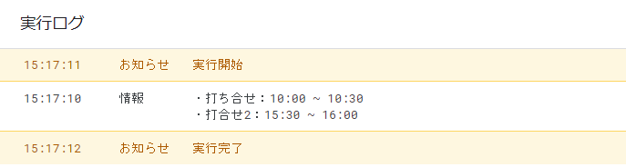

# 発展：ポストバックアクションを使ってみよう

今まではメッセージアクションを主に扱ってきましたが他にもLineは色んなアクションがあります。

今回はポストバックアクションを使い、ボタン付きのメッセージを送り、どのボタンが押されたか取得することで、押したボタンに応じて仕事やプライベートなど別々の予定を通知するlinebotを作ってみましょう。

<p class="image-with-caption">
    
    <span class="imagecaption photo">完成例</span>
</p>

### 目次

 - [LINE Bot Designerをインストール](#line-bot-designerをインストール)
   - [プロジェクト作成](#プロジェクト作成)
   - [テンプレート作成](#テンプレート作成)
   - [画像を用意しよう](#画像を用意しよう)
   - [プロパティの設定](#プロパティの設定)
 - [送信するメッセージを用意](#送信するメッセージを用意)
 - [ボタンが押された時の処理を用意](#ボタンが押された時の処理を用意)
   - [コード解説](#コード解説)
 - [カレンダーの用意](#カレンダーの用意)
   - [コード解説](#コード解説-1)
   - [コード解説](#コード解説-2)

<h3 id="line-bot-designerをインストール"> LINE Bot Designerをインストール</h3>

以下のURLからLINE Bot Designerをインストールすると手軽にボタンや日付選択するできるメッセージなどが作れます。

[https://developers.line.biz/ja/services/bot-designer/](https://developers.line.biz/ja/services/bot-designer/)

<h4 id="プロジェクト作成"> プロジェクト作成</h4>

インストールができたら早速「プロジェクトを作成」からプロジェクトを用意してみましょう。

<p class="image-with-caption">
    
    <span class="imagecaption photo">LINE Bot Designerを開いたところ</span>
</p>

「プロジェクト設定」のBot名、会社名、カテゴリーは適当なものでOKです。

<p class="image-with-caption">
    
    <span class="imagecaption photo">プロジェクト設定</span>
</p>

<h4 id="テンプレート作成"> テンプレート作成</h4>

色んなメッセージのテンプレートがありますが、今回はひとまず「メッセージ」の「ボタン型テンプレートメッセージ」を元に作っていきましょう。

他のものが気になる方はぜひ[公式ドキュメント](https://developers.line.biz/ja/docs/messaging-api/actions/)を参考に挑戦してみてください。

<p class="image-with-caption">
    
    <span class="imagecaption photo">「メッセージ」の「ボタン型テンプレートメッセージ」</span>
</p>

<h4 id="画像を用意しよう"> 画像を用意しよう</h4>

適当な画像を[Googleドライブにアップロード](https://d2tlis2max4tew.cloudfront.net/gas/ABGSZZ02_G004/ABGSZZ02_G004.html#Googleドライブにファイルをアップロードしよう)にしましょう。

「リンクを取得」からファイルIDを取得したら```https://drive.google.com/uc?id=```にファイルIDをくっつけた
```
https://drive.google.com/uc?id=ファイルID
```
というURLを元画像URLに入力します。

<h4 id="プロパティの設定"> プロパティの設定</h4>

* **タイトル**  
  太文字の見出しとして表示されます。  
  例：今日の予定  
* **テキスト**  
  詳細を書くことができます。  
  例：仕事の予定とプライベートの予定をチェックできるよ  
* **アクション数**  
  扱いたいボタンの数を決めることができます。  
  例：2  
* **アクション**  
  メッセージアクションなど様々なアクションが設定できます。  
  * タイプ  
  今回は**ポストバックアクションを設定**します。  
  * ラベル  
  ボタンの見出しになります。  
  アクション1例：仕事  
  アクション2例：プライベート  
  * テキスト  
  **今回は使わないので空白に**しておきましょう。  
  * データ  
  ボタンが押された時に送られてくるデータを指定します。  
  アクション1例：仕事  
  アクション2 例：プライベート  

<p class="image-with-caption">
    
    <span class="imagecaption photo">入力例</span>
</p>

入力し終えたら、右下の「JSON」と表示されている枠の中のコードをこの後使うので、LINEBotDesignerを開いたままにするか、適当にメモしておきましょう。

<h3 id="送信するメッセージを用意">送信するメッセージを用意</h3>

ひとまず、ボタン付きのメッセージを送ってみるプログラムを用意してみましょう。

前回までの節で記述したACCESS_TOKENとnotifyLine関数を流用します。

面倒な方は以下を参考にしてください。

```js
const ACCESS_TOKEN = `XXXXXX1234567YYYYYY`;

function notifyLine(message) {
  let USER_ID = `あなたのLINEユーザID`;
  let url = `https://api.line.me/v2/bot/message/push`;

  let headers = {
    "Content-Type": `application/json; charset=UTF-8`,
    "Authorization": `Bearer ${ACCESS_TOKEN}`
  };
  
  let data = {
    to: USER_ID,
    messages: [
      {
        type: `text`,
        text: message
      }
    ]
  };
  
  let options = {
    method: `post`,
    headers: headers,
    payload: JSON.stringify(data)
  };

  return UrlFetchApp.fetch(url, options);
}
```

では上記のコードをボタン付きメッセージを送るように改造していきましょう。

変更点は2点です。

* 関数名をsendPostbackMessageに変更
* messagesの```[]```の中身を先ほどメモしたテンプレートのコードに置き換える
<br>
<br>

```diff
-function notifyLine(message) {
+function sendPostbackMessage(message) {
  let USER_ID = `あなたのLINEユーザID`;
  let url = `https://api.line.me/v2/bot/message/push`;

  let headers = {
    "Content-Type": `application/json; charset=UTF-8`,
    "Authorization": `Bearer ${ACCESS_TOKEN}`
  };

  let data = {
    to: USER_ID,
    messages: [
-      {
-        type: `text`,
-        text: message
-      }
+      {
+        "type": "template",
+        "altText": "this is a buttons template",
+        "template": {
+          "type": "buttons",
+          "thumbnailImageUrl": "https://drive.google.com/uc?id=ファイルID",
+          "title": "今日の予定",
+          "text": "仕事の予定とプライベートの予定をチェックできるよ",
+          "actions": [
+            {
+              "type": "postback",
+              "label": "仕事",
+              "data": "仕事"
+            },
+            {
+              "type": "postback",
+              "label": "プライベート",
+              "data": "プライベート"
+            }
+          ]
+        }
+      }
    ]
  };
```

書けたら保存、実行し、メッセージが送れたか確認してみましょう。


<h3 id="ボタンが押された時の処理を用意">ボタンが押された時の処理を用意</h3>

既に記述したdoPost関数とreplyWithText関数を流用します。面倒な方は以下を参考にしてください。

```js
// POSTリクエストの処理
function doPost(e) {
  let jsonData = JSON.parse(e.postData.contents);
  let eventType = jsonData.events[0].type; // イベントタイプの取得
  if (eventType !== `message`) return; // メッセージイベント以外は無視する

  let message    = jsonData.events[0].message.text; // メッセージの取得
  let replyToken = jsonData.events[0].replyToken; // 返信用トークンの取得
  let userId     = jsonData.events[0].source.userId; // ユーザーIDの取得

  // メッセージの作成
  let replyMessage = `ユーザーID：${userId} さん、こんにちは\n受信できたメッセージは「${message}」です。`;

  // 返信
  replyWithText(replyMessage, replyToken);
}

function replyWithText(message, replyToken) {
  // 返信するメッセージオブジェクトの作成
  let postData = {
    replyToken: replyToken,
    messages: [
      {
        type: `text`,
        text: message
      }
    ]
  };

  // リクエストヘッダの作成
  let headers = {
    "Content-Type": `application/json; charset=UTF-8`,
    "Authorization": `Bearer ${ACCESS_TOKEN}`
  };

  // POSTオプション作成
  let options = {
    method: `post`,
    headers: headers,
    payload: JSON.stringify(postData)
  };

  return UrlFetchApp.fetch(`https://api.line.me/v2/bot/message/reply`, options);
}
```
replyWithText関数はそのまま利用します。

以下ではdoPost関数を改造して、ひとまず、ポストバックアクションを受け取って、どのボタンが押されたか返信するプログラムにしてみましょう。

```diff
 function doPost(e) {
   let jsonData = JSON.parse(e.postData.contents);
   let eventType = jsonData.events[0].type; // イベントタイプの取得
-  if (eventType !== `message`) return; // メッセージイベント以外は無視する
+  if (eventType !== `postback`) return; // ポストバックイベント以外は無視する

-  let message    = jsonData.events[0].message.text; // メッセージの取得
   let replyToken = jsonData.events[0].replyToken; // 返信用トークンの取得
-  let userId     = jsonData.events[0].source.userId; // ユーザーIDの取得
+  let postbackData = jsonData.events[0].postback.data;//アクションのデータに設定した値を取得

   // メッセージの作成
-  let replyMessage = `ユーザーID：${userId} さん、こんにちは\n受信できたメッセージは「${message}」です。`;
+  let replyMessage = `${postbackData}が押されました`;

   // 返信
   replyWithText(replyMessage, replyToken);
 }
```

<h4 id="コード解説">コード解説</h4>

イベントタイプの取得は既に学習した通り```jsonData.events[0].type```で取り出すことができます。

今回はひとまずポストバックイベントが取得できたか、というのを確認したいので```if (eventType !== `postback`)```でポストバックイベント以外は無視するという書き方にしました。

ポストバックイベントでどのボタンが押されたかどうかというのは```jsonData.events[0].postback.data```で取得することができます。このデータはあらかじめユーザーがLINE Bot Designerなどでアクション1やアクション2のデータに設定した値です。

今回はLINE Bot Designerで作成した際に、

```
         "actions": [
            {
              "type": "postback",
              "label": "仕事",
              "data": "仕事"
            },
            {
              "type": "postback",
              "label": "プライベート",
              "data": "プライベート"
            }
          ]
```

と設定しているので「仕事」というラベルのついたボタンを押せば```"仕事"```という文字列が、「プライベート」というラベルのついたボタンを押せば、```"プライベート"```という文字列が送信されます。

あとは```let replyMessage = `${postbackData}が押されました`;```でどのボタンが押されたかというメッセージを作成し、送り返すというだけのプログラムです。

以上の改造ができたら、保存し、[再度ウェブアプリとしてデプロイ](https://d2tlis2max4tew.cloudfront.net/gas/ABGSZZ07_G002/ABGSZZ07_G002.html#GASアプリケーションの更新)して手元で確認してみましょう。

<p class="image-with-caption">
    
    <span class="imagecaption photo">どのボタンが押されたか</span>
</p>

<h3 id="カレンダーの用意">カレンダーの用意</h3>

では今回使う、仕事用のカレンダーとプライベート用のカレンダーを作成してみましょう。

新しくカレンダーを用意するには「他のカレンダーを追加」から

<p class="image-with-caption">
    
    <span class="imagecaption photo">他のカレンダーを追加</span>
</p>

「新しいカレンダーを作成」し、

<p class="image-with-caption">
    
    <span class="imagecaption photo">新しいカレンダーを作成</span>
</p>

任意の名前でカレンダーを作ることができます。

<p class="image-with-caption">
    
    <span class="imagecaption photo">新しいカレンダーを作成2</span>
</p>

これでそれぞれのカレンダーが用意できたので、以下ではカレンダーの名前に応じて予定を取得するプログラムを書いていこうと思います。

取得の方法は[6章1節 GAS で Google カレンダーを扱ってみよう](https://d2tlis2max4tew.cloudfront.net/gas/ABGSZZ06_G001/ABGSZZ06_G001.html)の挑戦問題：日本の祝日を取得してみようで既に紹介された [CalendarApp.getCalendarsByName(name)](https://developers.google.com/apps-script/reference/calendar/calendar-app#getCalendarsByName(String)) を使います。

```js
function getSchedule(calendarName) {
  let calender = CalendarApp.getCalendarsByName(calendarName);// 指定した名前のカレンダーを取得
  let today = new Date();
  let events = calender[0].getEventsForDay(today);

  let scheduleText = ``;

  for (let event of events) {
    let title = event.getTitle(); // 予定の題名を取得
    let startTime = Utilities.formatDate(event.getStartTime(), 'Asia/Tokyo', 'HH:mm'); // 予定の開始時刻を取得
    let endTime = Utilities.formatDate(event.getEndTime(), 'Asia/Tokyo', 'HH:mm'); // 予定の終了時刻を取得
    scheduleText += `・${title}：${startTime} ~ ${endTime}\n`;
  }

  return scheduleText;
}
```

<h4 id="コード解説-1">コード解説</h4>

[CalendarApp.getCalendarsByName(name)](https://developers.google.com/apps-script/reference/calendar/calendar-app#getCalendarsByName(String))で名前を指定してカレンダーを取得する以外は7章3節の[カレンダーの予定を LINE に通知するスクリプト](https://d2tlis2max4tew.cloudfront.net/gas/ABGSZZ07_G003/ABGSZZ07_G003.html#カレンダーの予定をLINEに通知するスクリプト)で書いた```getTodayEvents()```とほぼ同じコードです。

ただし、今回の場合、取得したいカレンダーはどのボタンが押されたかによって変わるので引数で指定するカレンダーの名前を渡し、それに応じて予定の題名と開始時刻と終了時刻をまとめたものを返すという関数を作りました。

ちゃんとカレンダーの名前に応じて取得できたか確認したい際には適当なテスト用の関数を作ると良いでしょう。

```js

function getScheduleTest(){
  console.log(getSchedule("仕事"));
}

```


<p class="image-with-caption">
    
    <span class="imagecaption photo">仕事のスケジュールのみ取得できた</span>
</p>
<p class="image-with-caption">
    
    <span class="imagecaption photo">仕事のスケジュールのみ取得できた</span>
</p>


あとは以上の要素を組み合わせ

* 「今日の予定」というメッセージを受け取ったら、ボタン付きメッセージを送信
* ボタンが押されたら、押されたボタンに応じて予定を通知する

という部分を作っていきましょう。

```js
function doPost(e) {
  let jsonData = JSON.parse(e.postData.contents);
  let eventType = jsonData.events[0].type; // イベントタイプの取得
  if(eventType === `message`){
    if(jsonData.events[0].message.text === `今日の予定`){
      sendPostbackMessage();
   }
   return ;
  }
  if (eventType === `postback`){
  let replyToken = jsonData.events[0].replyToken; // 返信用トークンの取得
  let postbackData = jsonData.events[0].postback.data;//アクションのデータに設定した値を取得

  // メッセージの作成
  let replyMessage = `今日の${postbackData}の予定は\n${getSchedule(postbackData)}`;

  // 返信
  replyWithText(replyMessage, replyToken);
  }
}
```

<h4 id="コード解説-2">コード解説</h4>

メッセージイベントの時、かつ「今日の予定」というメッセージだった場合、```sendPostbackMessage```関数でボタン付きのメッセージを送信します。

ポストバックイベントの時、送られてきたデータを```postbackData```に取り出したら```getSchedule```関数に渡して、予定を取得します。

取得した予定を元にメッセージを作成したら```replyWithText```関数で送信します。

これで基本的なポストバックアクションについては扱うことができるようになりました。ぜひ参考にして他のアクションなどに挑戦してみてください。
