# GASでslackbotを作る

今回は簡単にslack上に投稿されたメッセージをオウム返しするというbotを作ってみましょう。

オウム返しbotを作るにあたって主に二つのアプリを作成していきます。
* slackに投稿されたメッセージを特定のURLに送信するslackアプリを作成
* slackアプリから送信されるメッセージをslackにオウム返しで投稿するwebアプリをGASで作成

### 目次

- [開発用のworkspaceを作る](#開発用のworkspaceを作る)
- [slackアプリを作る](#slackアプリを作る)
  - [botのアイコンの設定](#botのアイコンの設定)
  - [botの権限の設定](#botの権限の設定)
- [GASでwebアプリを作る](#gasでwebアプリを作る)
  - [webアプリとしてデプロイ](#webアプリとしてデプロイ)
- [イベントの設定](#イベントの設定)
- [webhookの設定](#webhookの設定)
- [webhookを利用したコードに改変](#webhookを利用したコードに改変)
- [botをチャンネルに追加する](#botをチャンネルに追加する)

<h3 id="開発用のworkspaceを作る"> 開発用のworkspaceを作る</h3>

フリープランの場合slackのワークスペースに追加できるアプリの個数は限られているため、別途、開発用のワークスペースを作るとよいでしょう。

以下のURLからワークスペースを作成することができます。

[https://slack.com/get-started#/createnew](https://slack.com/get-started#/createnew)

アクセスするとGoogleないしappleアカウントでのログインかメールアドレスの入力を求められますがどれでもかまいません。

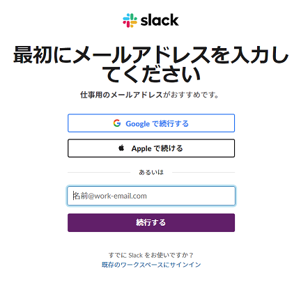
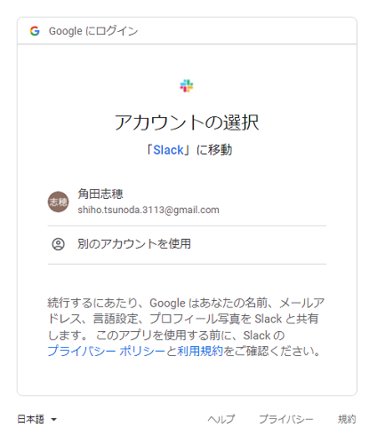

では早速「ワークスペースを作成する」から作っていきましょう。

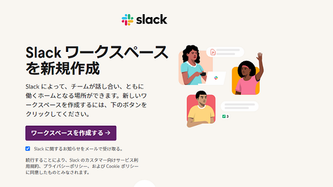

ワークスペースの名前は何でもかまいません。画面では適当に「botのテスト用」としました。

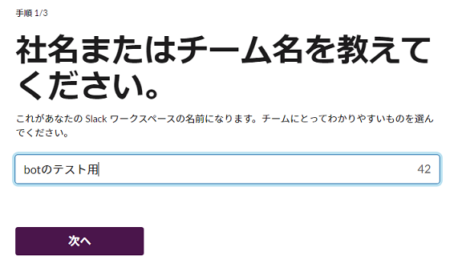

ワークスペースの説明についても適当でかまいません。

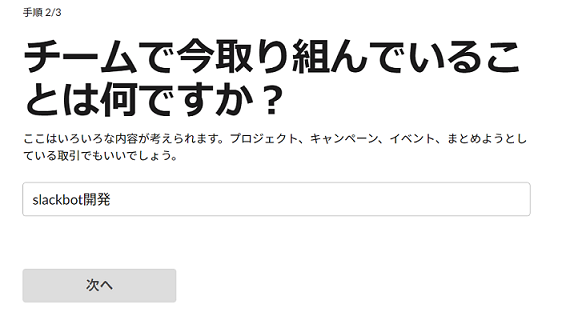

チームメンバーを追加はスキップしましょう。

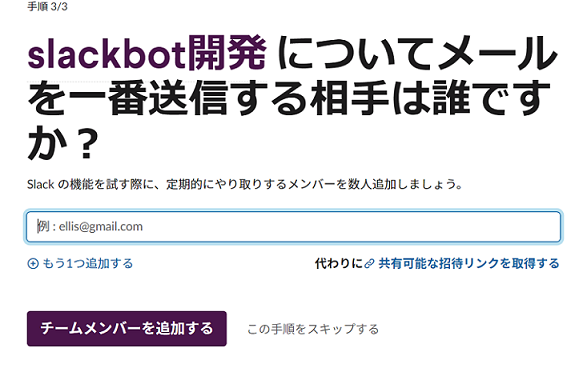
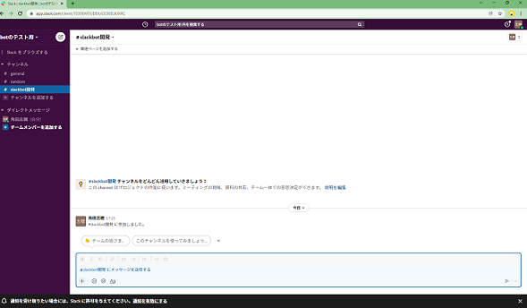


<h3 id="slackアプリを作る"> slackアプリを作る</h3>

開発用のワークスペースが作成できたので、次はslackに投稿されたメッセージを特定のURLに送信するslackアプリを作成していきましょう。

以下のURLから作成することができます。

[https://api.slack.com/apps](https://api.slack.com/apps)

「Create an App」から「From scrach」を選択。

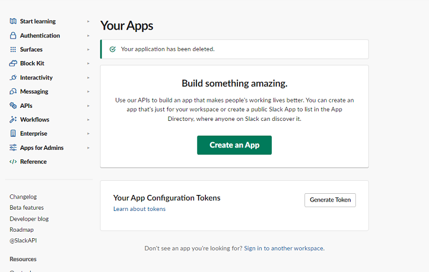
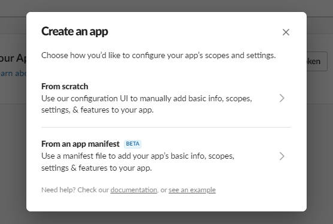

「App Name」にこれから作るアプリの名前を入力しましょう。これも適当なもので構いません。

「Pick a workspace to develop your app in」には先ほど作成した開発用のワークスペースを選択し、できたら「Create App」をクリックしましょう。

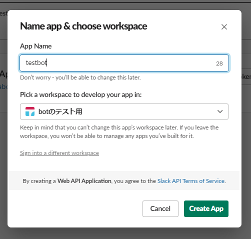

すると以下のような画面になったかと思います。

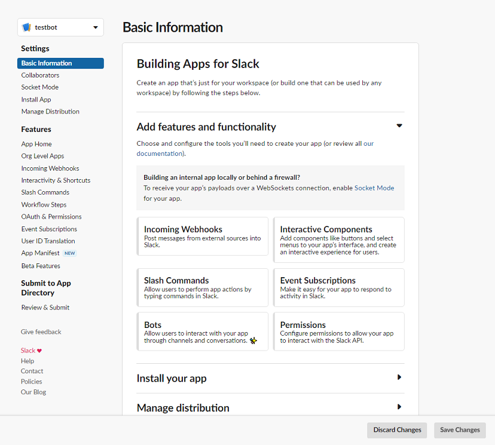

<h4 id="botのアイコンの設定"> botのアイコンの設定</h4>

この節はスキップしてもかまいません。

「Basic Information」の画面から下にスクロールしていくと「Display Information」でbotのアイコンを設定することができます。


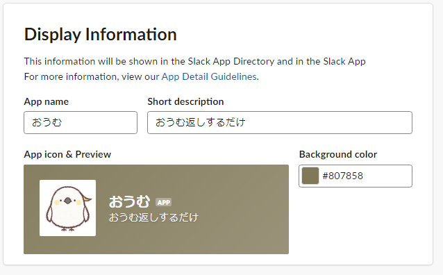


あまり小さい画像だと設定することができない(512pxから2000pxまでのサイズが必要)ので適当なサイズのものを設定すると良いでしょう。

またここでbotの名前や説明についても変更することができます。

**設定できたら右下の「Save change」から保存するのを忘れないようにしましょう。**

<h4 id="botの権限の設定"> botの権限の設定</h4>

それでは次にbotがチャンネルのアクセスや投稿されたメッセージを取得できるよう、botに権限を与えていきましょう。

画面左のメニューから「OAuth & Permissions」画面を開き「Scopes」の、

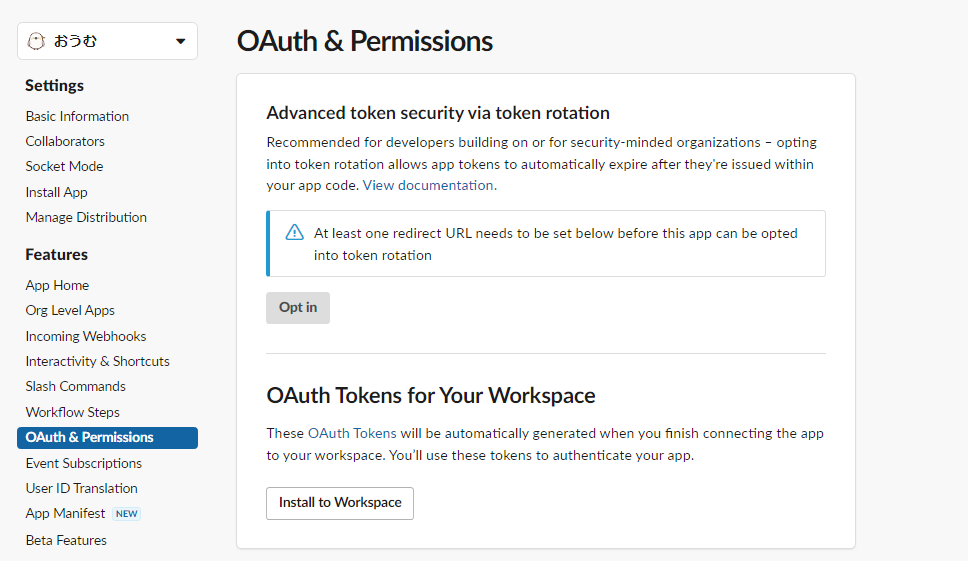
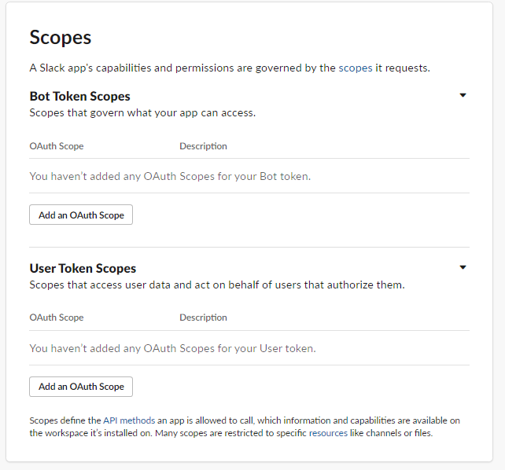

「Bot Token Scopes」の「Add an OAuth Scope」から「Channels:history」を設定します。

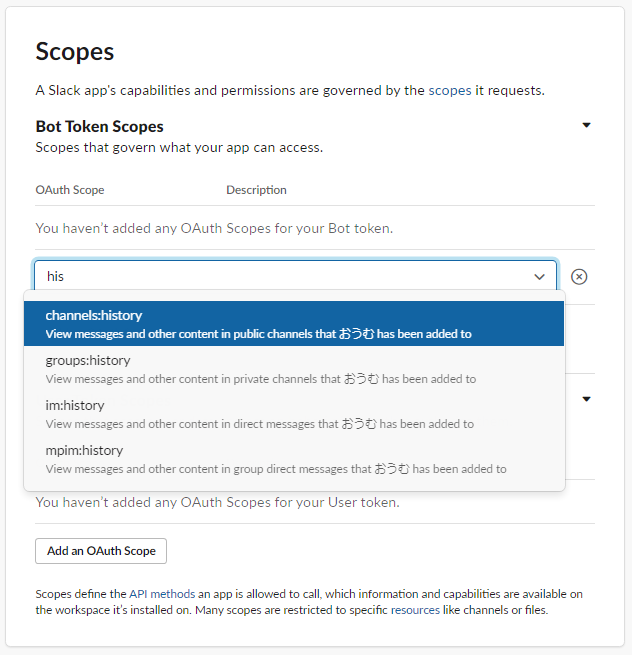
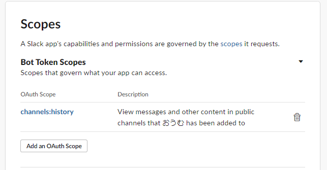

##### 補足
* 公開のチャンネルのメッセージを取得したい場合：```channels:history```
* privateのチャンネルのメッセージを取得したい場合：```groups:history```
* bot宛てのDMを取得したい場合、デフォルトではbotにDMを送れない設定になっているのであらかじめ「App Home」の「Messages Tab」の「Direct messages your app sends will show in this tab」にチェックを入れた上で「OAuth & Permissions」から```im:history```(個人間のDM)ないし```mpim:history```(複数人でのDM)の権限を設定。

これでbotがチャンネルに投稿されたメッセージを取得できるように設定できました。

ではいよいよ「イベント(slackにメッセージが投稿されたら)が発生したら指定したURLにメッセージを送信する」という設定をしたいのですが…。

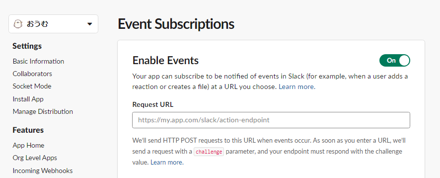

送り先のwebアプリのURLが必要なのでこの時点ではまだ設定することができません。

また合わせて、以下の文章に注目しておきましょう。

> We’ll send HTTP POST requests to this URL when events occur. As soon as you enter a URL, we’ll send a request with a challenge parameter, and your endpoint must respond with the challenge value.

初回に限り、URLの確認のためにslackアプリが登録したURLにHTTP通信のPOSTという形式で```challenge```パラメータを含んだリクエストを送信します。そしてその```challenge```パラメータを送り返すようなwebアプリでないと、slackと連携することができないようです。

詳しい内容が見たい場合は[公式ドキュメント](https://api.slack.com/events/url_verification)から確認することができます。

<h3 id="gasでwebアプリを作る">GASでwebアプリを作る</h3>

では以上で確認したことを踏まえて一旦GASの方で```challenge```パラメータを送り返すwebアプリを作っていきましょう。

プロジェクトの新規作成は割愛します。

```js
function doPost(e){
  let jsonData = JSON.parse(e.postData.getDataAsString());

  //  初回の確認
  if(jsonData.type === `url_verification`){
    return ContentService.createTextOutput(jsonData.challenge);//受け取ったchallengeパラメータを返す
  }
}
```

#### コード解説

GASではPOST形式で送信された内容はdoPost関数の引数として取得することができます。

引数 e には Slack 側から渡されてくるパラメータが格納されます。e.postData.getDataAsString() などで Slack 側から渡されたデータを取得できます。 許可したイベントの情報（例えば Slack で発言されたメッセージなど）や、Bot 自体の情報などが入っています。

このコードは Event Subscription の初回登録に必要となる認証用のコードです。 リクエストパラメータの type が url_verification の時は、リクエストパラメータの challenge に設定されている値をそのままレスポンスとして返す処理になっています。

できたらwebアプリとしてデプロイしましょう。

<h4 id="webアプリとしてデプロイ">webアプリとしてデプロイ</h4>

Google Apps Script は ウェブアプリや API として公開できる機能 [Web Apps](https://developers.google.com/apps-script/guides/web) があります。

この Web Apps 機能を使ってアプリを公開し、slack から通知を受け取れる状態にすることで、 slack に投稿されたメッセージをGASで取得できるようになります。

右上の青い「デプロイ」と書かれているボタンをクリックしてメニューを出します。

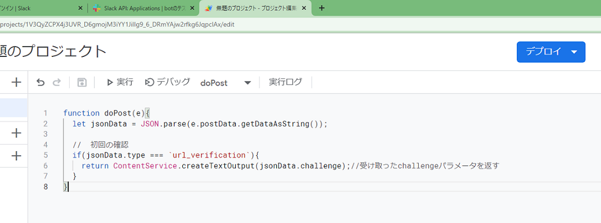
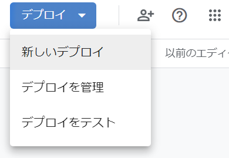

デプロイの設定ウィンドウが表示されます。
「種類の選択」の横にある歯車のアイコンをクリックしてメニューを表示し、「ウェブアプリ」を選択してください。

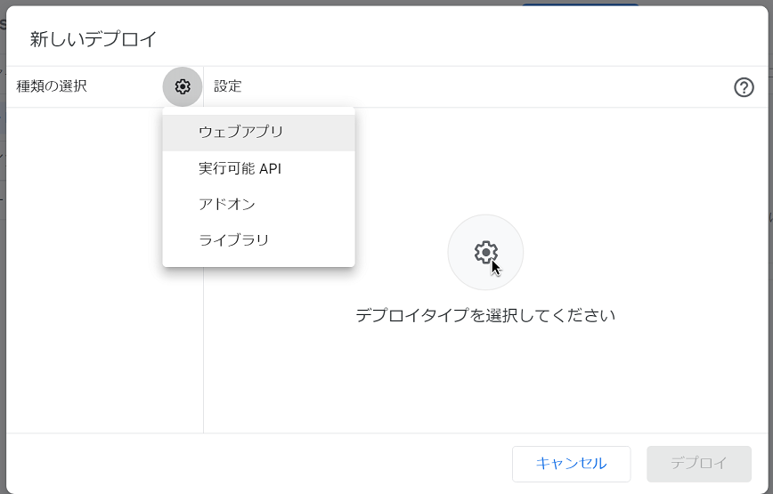

  「新しい説明文」には、アプリの説明を記入して下さい。  
  「ユーザー」には自分のアカウントを設定して下さい。  
  「アクセスできるユーザー」には **全員** を設定して下さい。これは、LINE が受信したメッセージを Google Apps Script ウェブアプリに送信しますので、それを受信できるようにこのように設定しています。

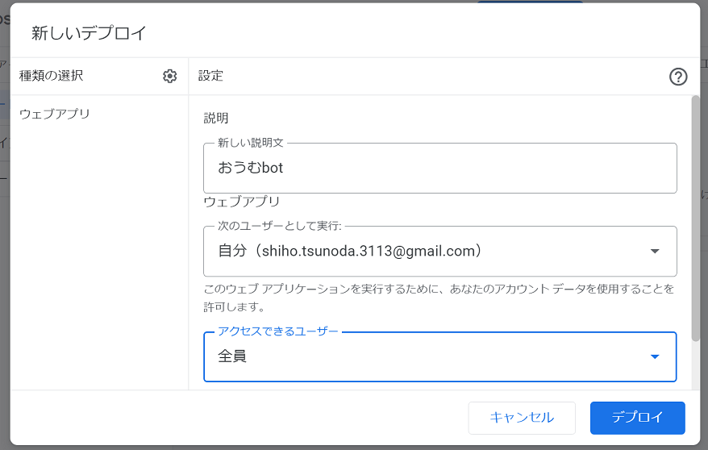


設定が完了し、「デプロイ」ボタンをクリックするとウェブアプリがデプロイされ、ID と URL が発行されます。

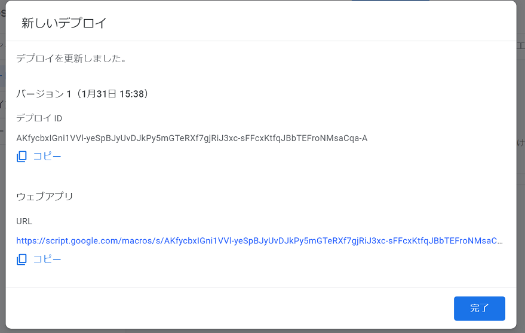


上の 「ウェブアプリ」の URL を控えておきます。

<h3 id="イベントの設定">イベントの設定</h3>

**ここからはSlackアプリの話になります。**

「Event Subscriptions」の「Enable Events」をONにします。

「Request URL」に先ほどメモしたwebアプリのURLを入力しましょう。

ちゃんとchallengeパラメータを送り返すことができていれば、Verified(確認済み)という表示になります。

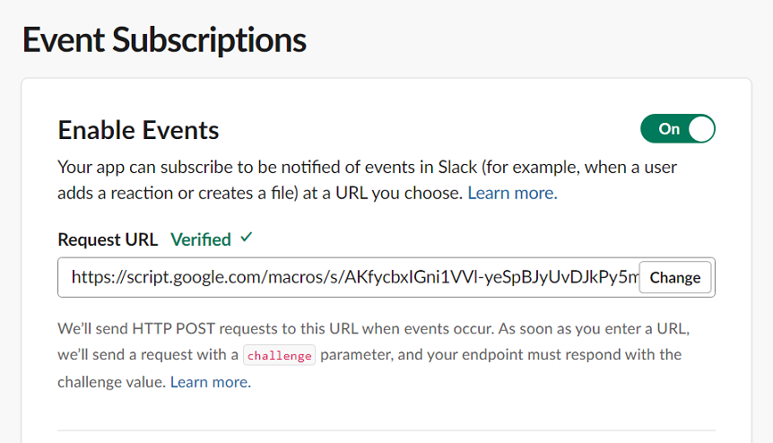

確認ができたら、「Subscribe to bot events」の「Add Bot User Event」でbotが反応するイベントに「message.channels(公開チャンネルにメッセージに投稿されたら)」を追加します。

<p class="image-with-caption">
    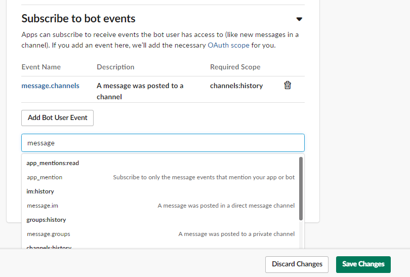
    <span class="imagecaption photo">イベントを登録</span>
</p>

**追加が出来たら「Save Changes」で保存することを忘れないようにしましょう。**

<h3 id="webhookの設定">webhookの設定</h3>

「Incoming Webhooks」の「Activate Incoming Webhooks」をONにします。

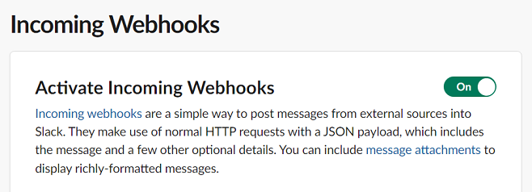

「Add New Webhook to Workspace」から開発用のワークスペースにIncoming Webhooks をインストールします。

投稿先のチャンネルは適当なものでかまいません。

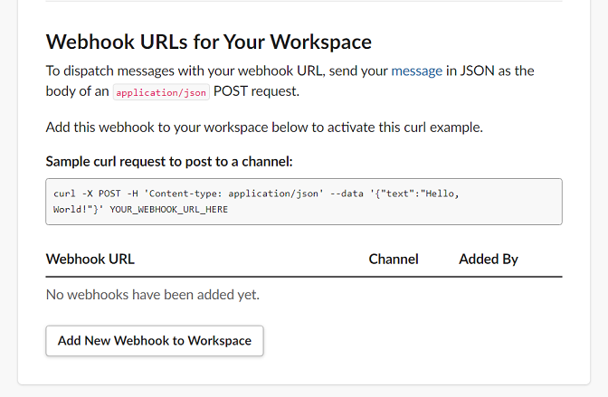

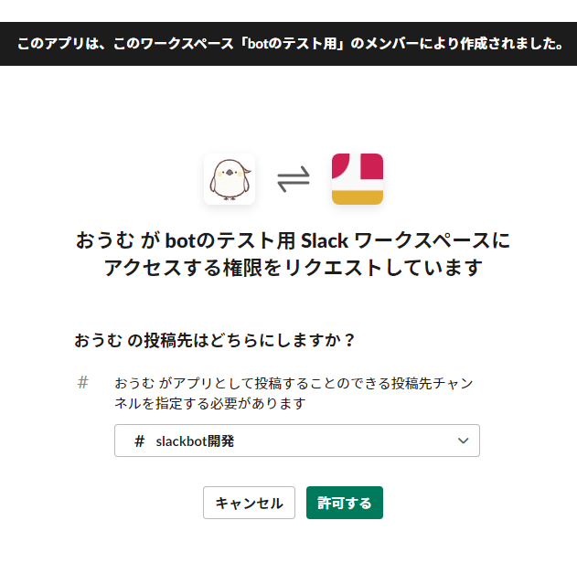

再インストールを求められた場合は、「reinstall your app」から再インストールしましょう。

<p class="image-with-caption">
    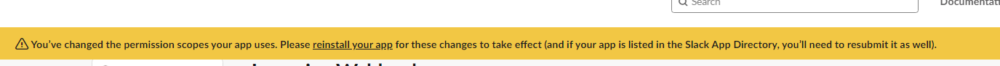
    <span class="imagecaption photo">再インストールを求める通知</span>
</p>

インストールできたらURLをコピーしましょう。

<p class="image-with-caption">
    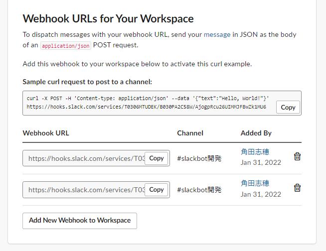
    <span class="imagecaption photo">URLを取得</span>
</p>

<h3 id="webhookを利用したコードに改変">webhookを利用したコードに改変</h3>

**ここからはGASに戻ります。**

では先ほどメモしたWebHookのURLを利用して受け取ったメッセージを送り返すコードに改変していきます。

```js
const WebHookURL = `先ほどメモしたWebHookのURL`;

function doPost(e){
  let jsonData = JSON.parse(e.postData.getDataAsString());

  //  初回の確認
  if(jsonData.type === `url_verification`){
    return ContentService.createTextOutput(jsonData.challenge);//受け取ったchallengeパラメータを返す
  }
  // Botの投稿に反応しないようにする
  if(jsonData.event.subtype === `bot_message`){
    return;
  }
  
  sendToSlack(jsonData.event.text,`任意のチャンネル名`)
}
```

<br>

```diff
 function sendToSlack(body, channel) {
   let data = {
     channel: channel,
-    'username': 'Googleフォーム Bot',
     'text': body,
-    'icon_emoji': ':date:'
   };
   let payload = JSON.stringify(data);
   let options = {
     'method': 'POST',
     'contentType': 'application/json',
     'payload': payload
   };
   let response = UrlFetchApp.fetch(WebHookURL, options);
}
```

#### コード解説

```sendToSlack```関数のコードは以前の章で出てきたものの流用ですが、今回作成したアプリはアイコンと名前はslackアプリの管理画面からしか変更できないため、```username```や```icon_emoji```は削除しておくとよいでしょう。

またbot自身のメッセージに反応しないようにするには```jsonData.event.subtype```が```bot_message```かどうかで判断することができます。

```jsonData.event.text```にslackに投稿されたメッセージが保存されているので、今回はそれをおうむ返ししてみましょう。

改変ができたら再度デプロイしていきましょう。

「デプロイを管理」から「編集」、「バージョン」から「新バージョン」を選択しましょう。

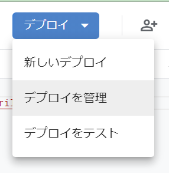
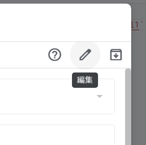
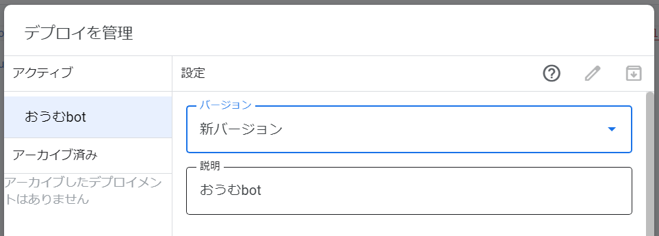

<h3 id="botをチャンネルに追加する">botをチャンネルに追加する</h3>

以下のコマンドを チャンネルで打ち込むと、Bot を招待できます

```/invite @作成したBot名```

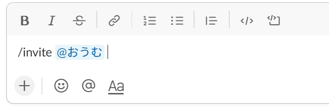

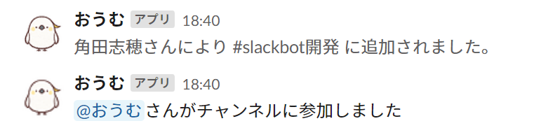

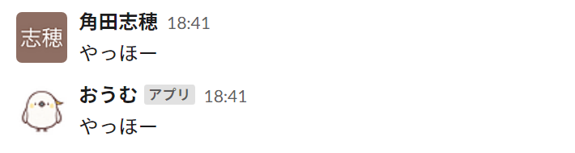


